# Mob Tools

Mob Tools is a small spigot plugin with a couple utility functions to assist with spawn-proofing,
mob spawners, and finding wither cages.

## Spheres

`/mksphere <radius> [semisphere?] [force visible?]`

Summons a particle sphere at the player's location

- **radius**: `number`, sphere's radius
- **semisphere?**: `true` or `false`, only render the bottom half of the sphere
- **force visible?** `true` or `false`, force particle visibility at any range (by default particles are only visible from ~30 blocks)

This is useful for visualizing a spawn radius around an afk platform, simply run `/mksphere 128 true`.

Use `/cancelspheres` to despawn summoned spheres, and a server operator can use `/cancelspheres all` to remove every particle sphere.

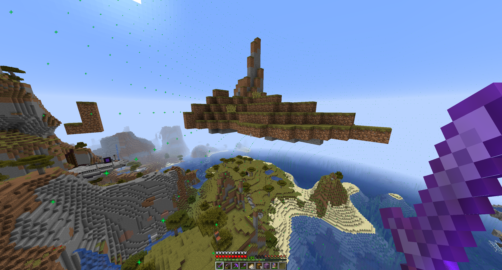

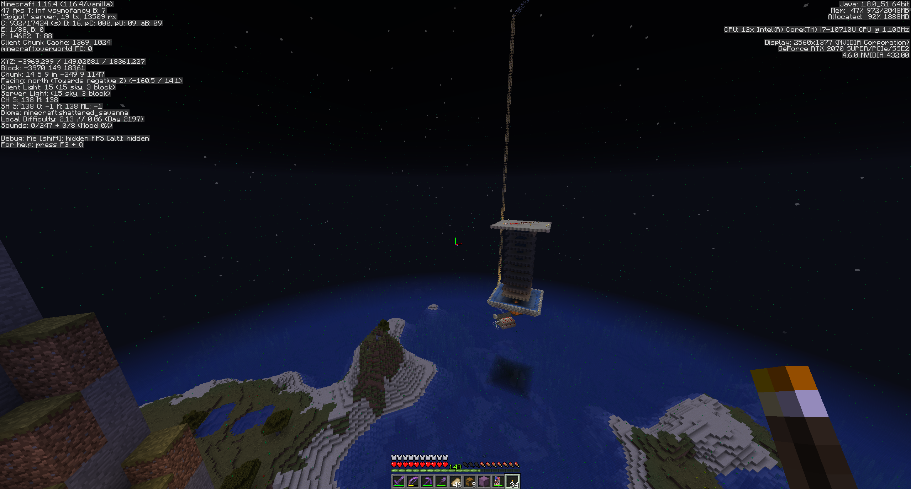
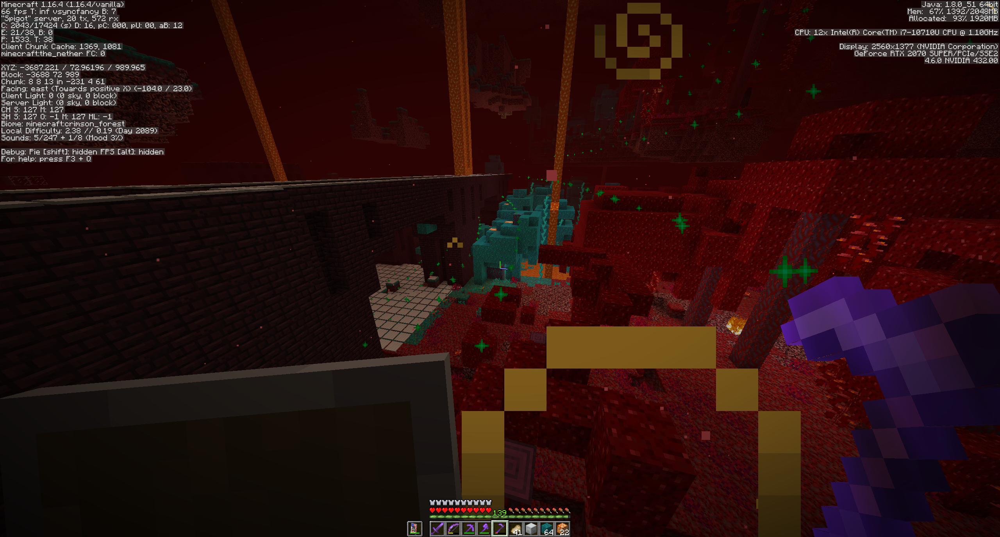

## Spawn Visualization

`/showspawn` will visualize spawnable spaces around the player. Green particles represent safe blocks and white firework trails represent spawnable spaces.

Running `/showspawn` again will stop showing spawnable spaces.

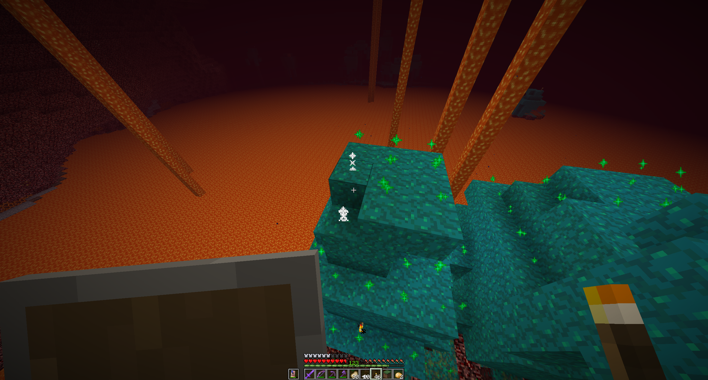
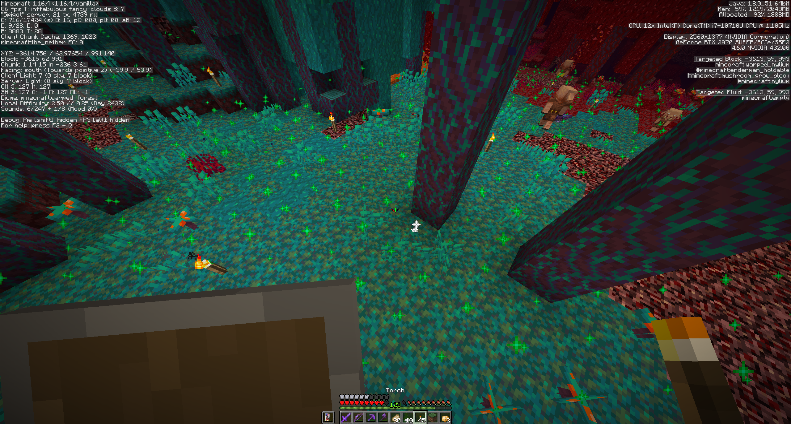

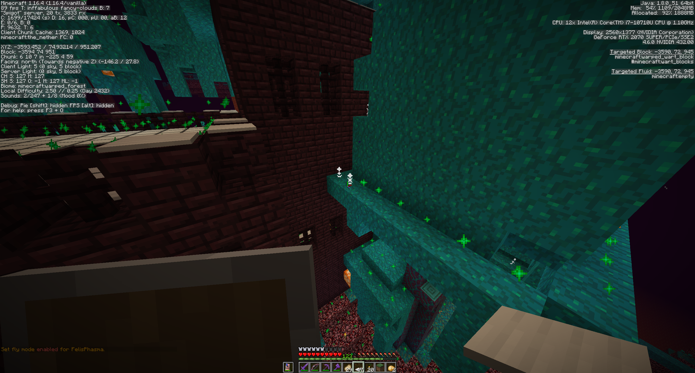
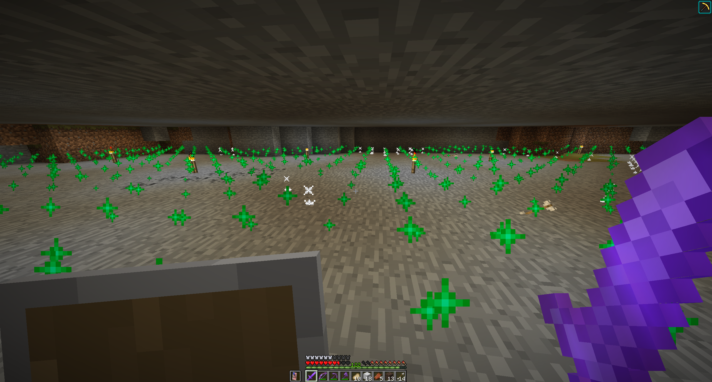

## Wither Cage Finder

`/locatebedrockcage` will scan the area surrounding the player and locate a 3x3x3 bedrock cube in the nether. This formation is useful as a cage to trap and kill a wither.

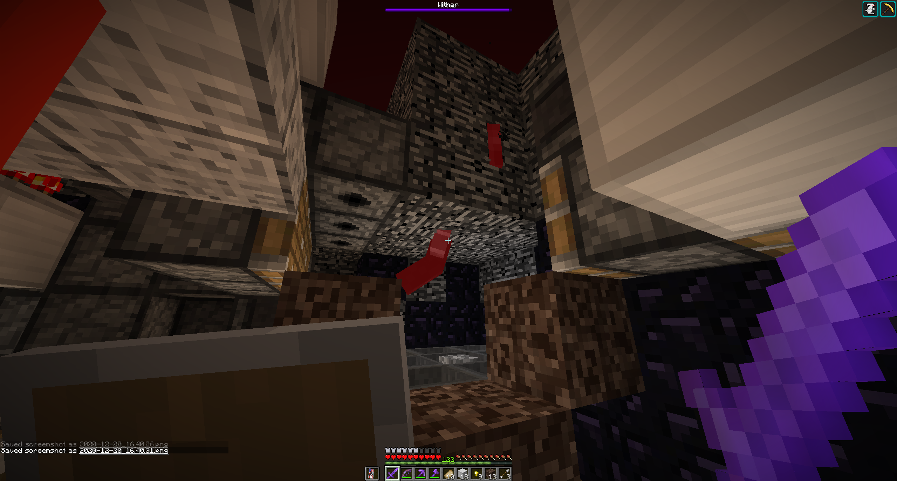

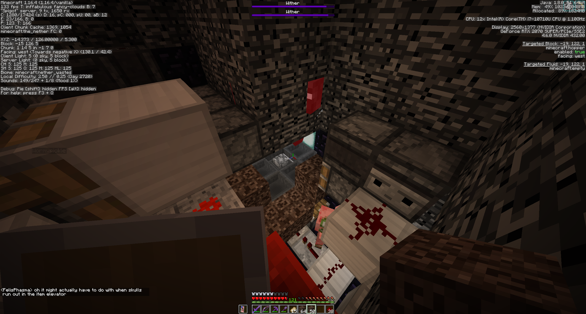
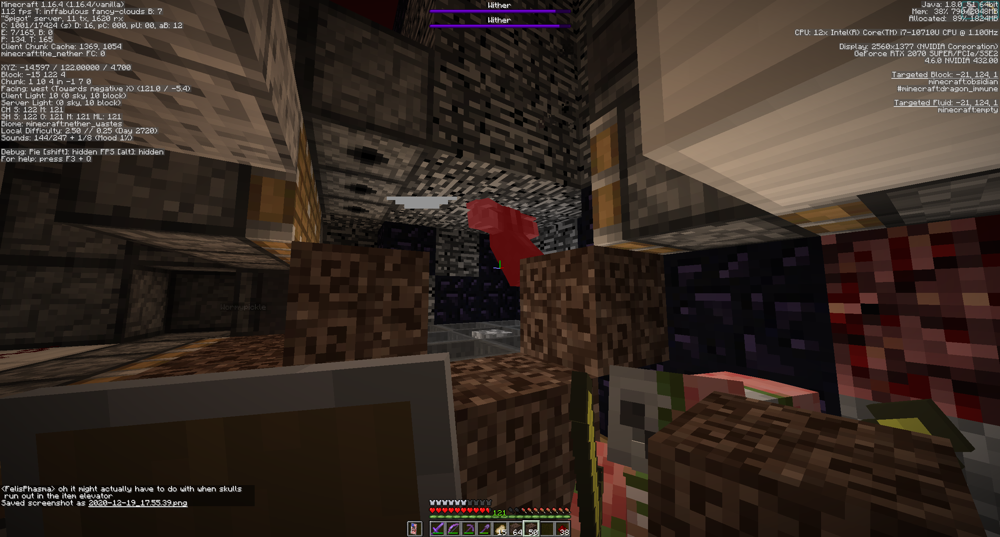
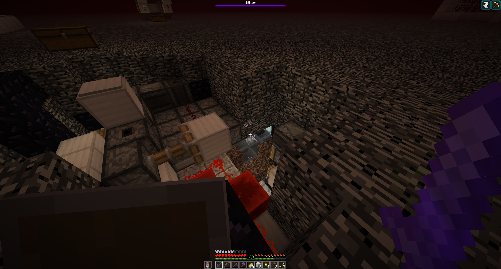
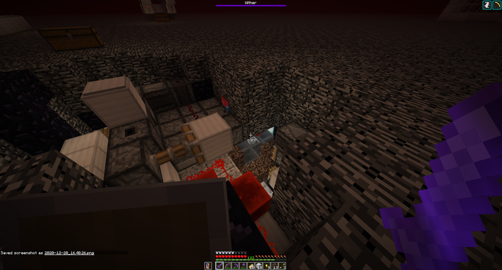
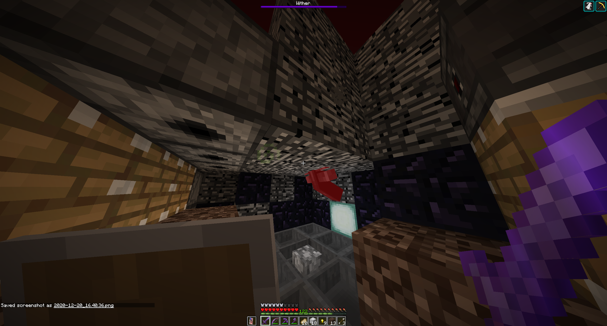
