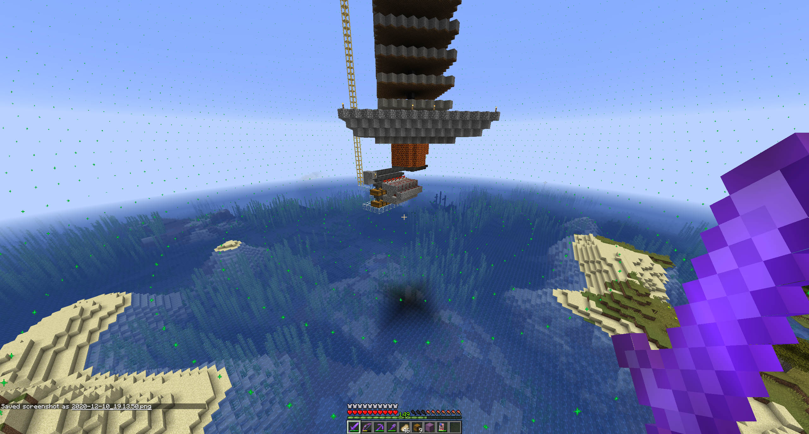
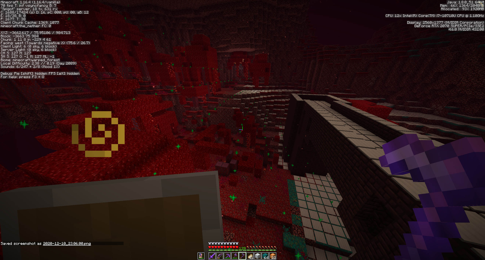
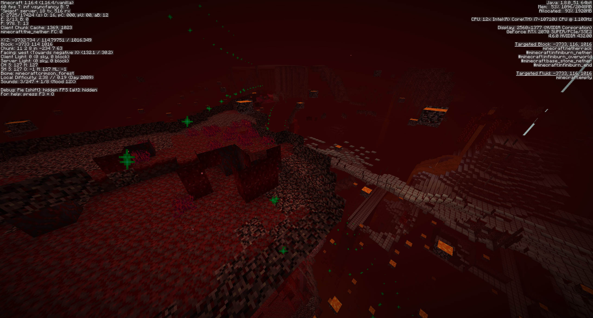
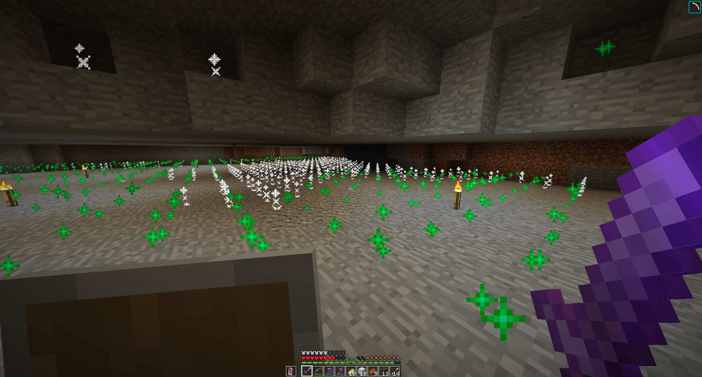
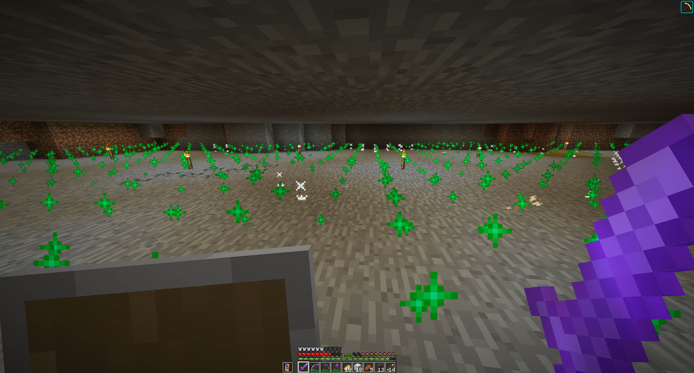
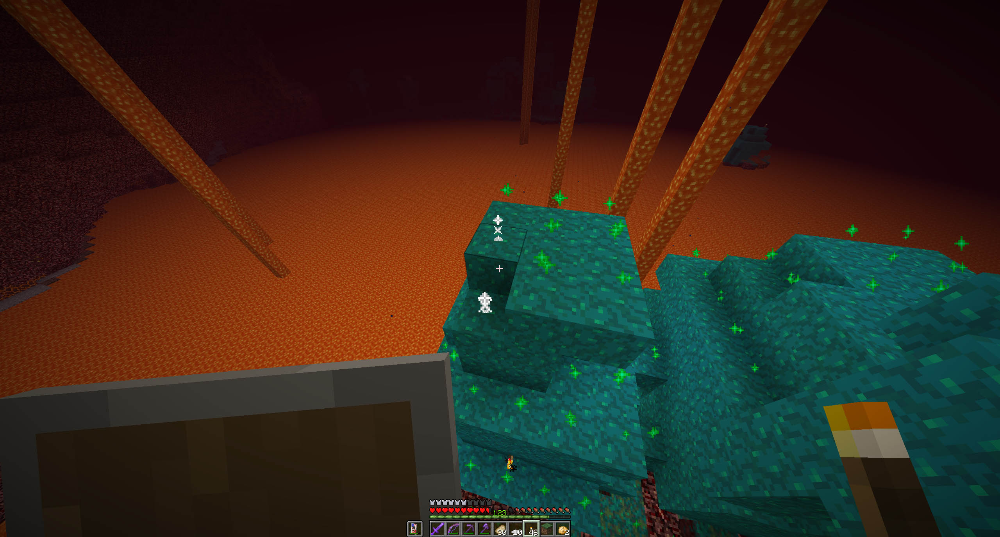
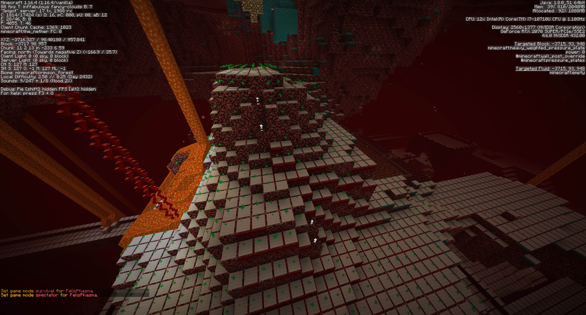
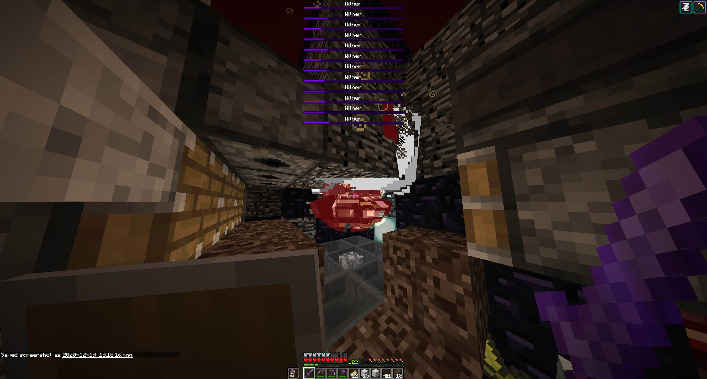

# Mob Tools

This is a Minecraft plugin with some utilities to help with making mob farms and spawn-proofing the surrounding area. This plugin adds a command to draw a sphere around a player (or spawn radius around an afk platform) and a utility to display spawnable blocks around the player. It also adds a command to search the nether roof for a 3x3x3 bedrock "cage" for fighting the wither.

[**Download**](https://github.com/jeremy-rifkin/MinecraftMobTools/raw/master/out/artifacts/MobTools_jar/MobTools.jar)

### Table of contents:
- [Spheres](#spheres)
- [Spawn Visualization](#spawn-visualization)
- [Wither Cage Finder](#wither-cage-finder)
- [Permissions](#permissions)

## Spheres

`/mksphere <radius> [semisphere?] [force visible?]`

Summons a particle sphere at the player's location

- **radius**: `number`, sphere's radius
- **semisphere?**: `true` or `false`, only render the bottom half of the sphere
- **force visible?** `true` or `false`, force particle visibility at any range (by default particles are only visible from ~30 blocks)

This is useful for visualizing a spawn radius around an afk platform, simply run `/mksphere 128 true`.

Use `/cancelspheres` to despawn summoned spheres, and a server operator can use `/cancelspheres all` to remove every particle sphere.

Sphere showing the spawn radius around an afk platform. This mob farm is high off the ground so no mob proofing needed to be done.

Spawn radius sphere being used to spawn-proof part of the nether.

Spawn radius sphere identifying part of a nether roof cave in spawn range.

## Spawn Visualization

`/showspawn` will visualize spawnable spaces around the player. Green particles represent safe blocks and white firework trails represent spawnable spaces.

Running `/showspawn` again will stop showing spawnable spaces.

`/showspawn` can also take a light level argument. Light level can be an integer 0-15 or "any". This is helpful for the nether which has complicated spawn rules. Running `/showspawn [light level]` will update the current visualization's light level instead of cancelling the current visualization.

Particles showing where mobs can spawn in a base.

Low-light spawnable spaces between torches.

Spawnable spaces on a warped fungus.

Particles showing missed blocks in a previously spawn-proofed area.

## Wither Cage Finder

`/locatebedrockcage` will scan the area surrounding the player and locate a 3x3x3 bedrock cube in the nether. This formation is useful as a cage to trap and kill a wither.

Wither trapped in a wither cage.

Wither spawning machine used to spawn dozens of withers in a wither cage.

## Permissions

The plugin defines the following permission nodes:

| node | default | description |
-- | -- | --
`mobtools.spheres` | `false` | permission to create and remove spheres
`mobtools.showspawn` | `false` | gives access to the /showspawn command
`mobtools.locatebedrockcage` | `false` | gives access to the /locatebedrockcage command
`mobtools.all` | `op` | gives access to all commands
